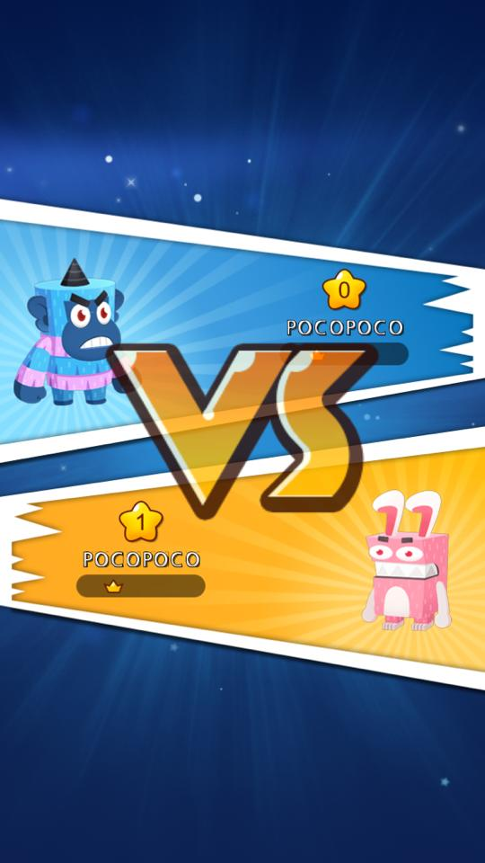
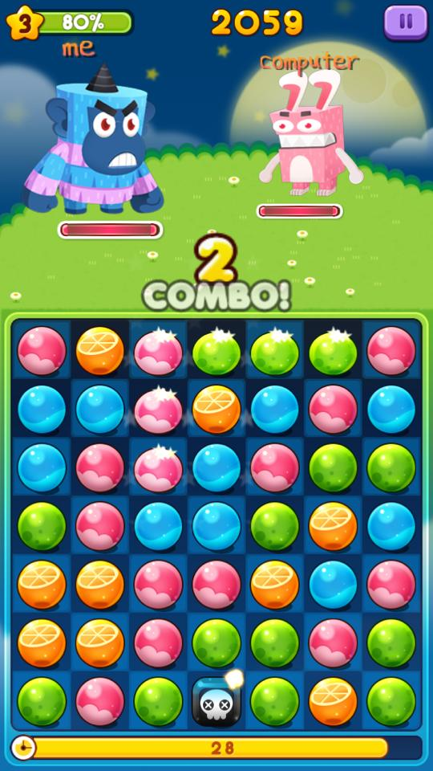
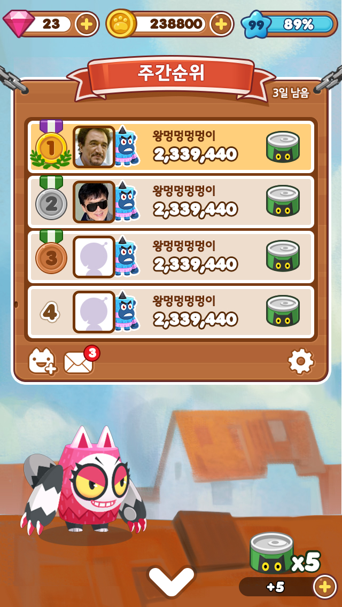
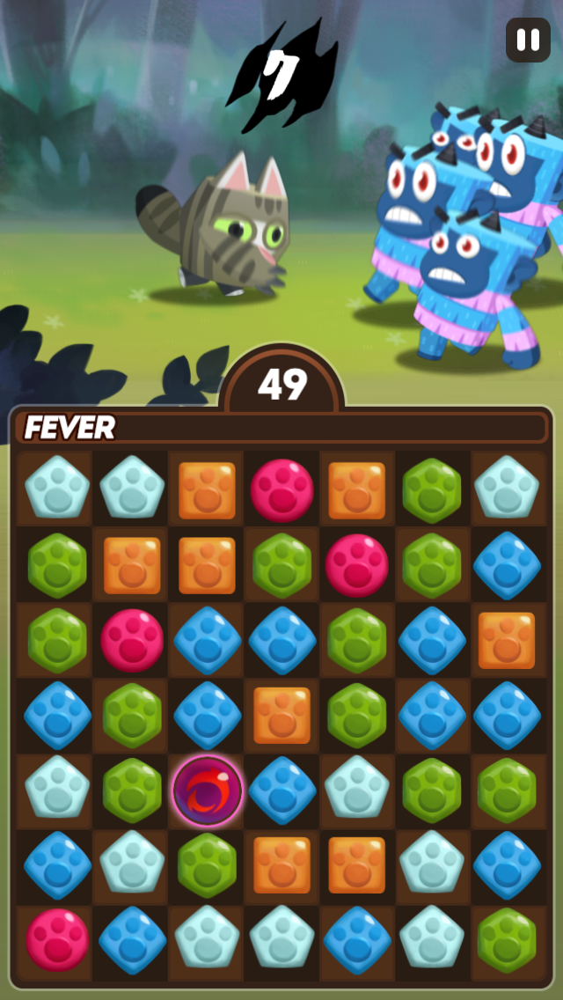
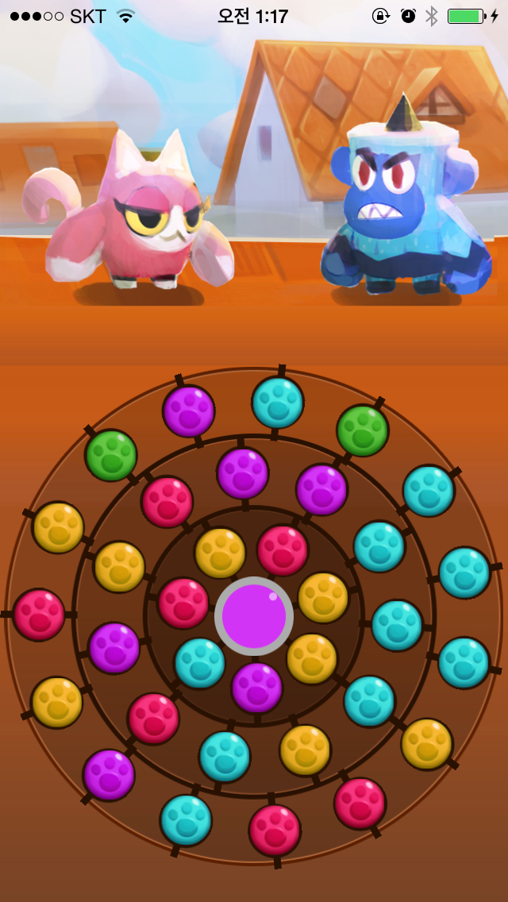
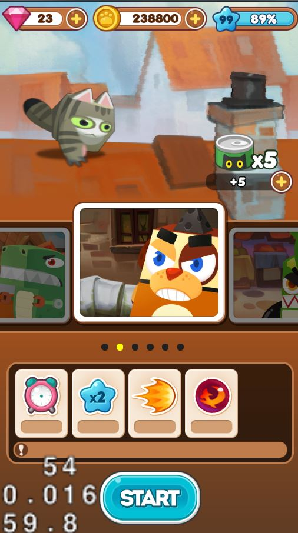
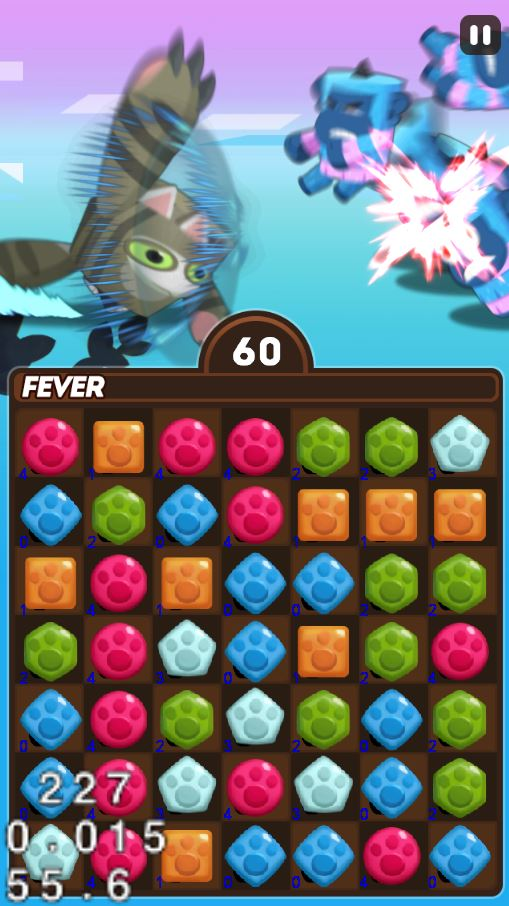

cocopang
====

* __사용 언어__ : C++
* __사용 프레임워크__ : cocos2d-x
* __설명__ : 대전 팡 게임입니다.
  * 랭킹 등의 기능은 동작하지 않습니다.
* __역할__ : 클라이언트 개발 전체, 서버 프로토타입 개발(초기)
* __개발 인원__ : 2명 (프로그래밍파트만)
* __담당 역할__ : 클라이언트 프로그래밍 전체
* 기획이 여러 번 바뀌어서 다양한 버전이 있습니다.

Screenshots
----
 
 
 
 
 
 
 
 
