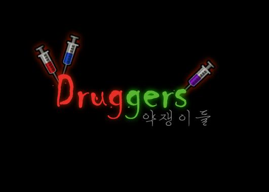
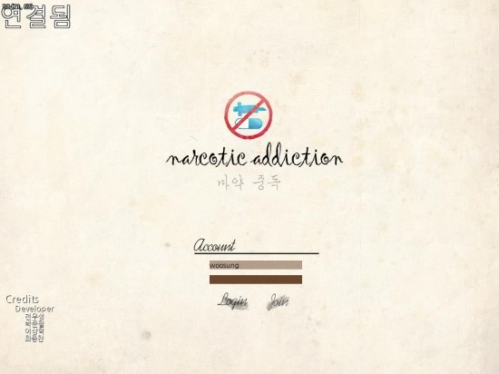
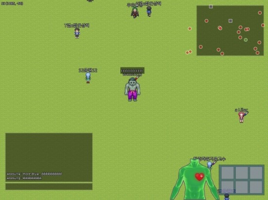

DrugAddiction
====

* __사용 언어__ : C++(클라이언트) / C#(서버) / Javascript(AI)
* __설명__ : 글로벌 게임잼에 참가하여 4인팀을 이뤄 개발한 온라인 게임입니다.
  * 로그인 할 경우 자동으로 빈방에 입장되며 인원이 맞으면 자동으로 시작됩니다.
  * 맵 곳곳에 약물이 드랍되어 있는데, 약물을 일정 시간 이상 주입할 경우 헐크로 변하게 됩니다.
  * 상대방을 공격하여 약물을 주입하는 행위를 막을 수 있습니다.
  * 헐크로 변신하면 능력치가 강력해지며 다른 사람들은 헐크로 변한 플레이어와 싸워 이겨야 합니다.
  * 다른 사람이 헐크로 변하지 않도록 방해하면서, 자신은 몰래몰래 약물을 주입하여 헐크가 되는것이 목적입니다.
* __개발 인원__ : 4인
* __담당 역할__ : 클라이언트 프로그래밍, 네트워크 프로그래밍(서버-클라이언트간 통신 모듈 제작, 핸들링)
  
Screenshots
-----
 
 

