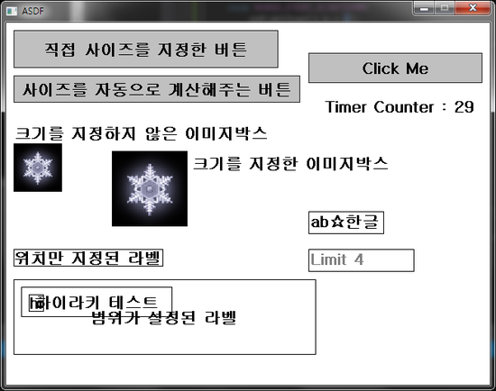
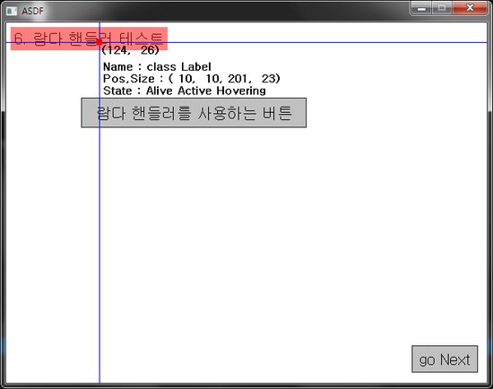
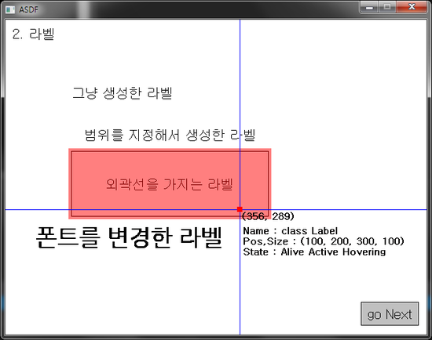
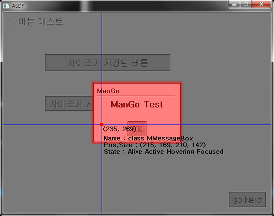
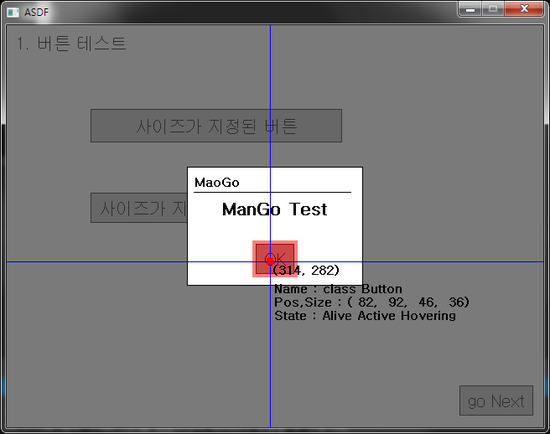
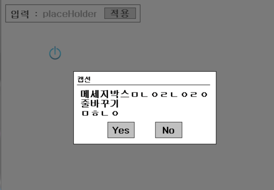
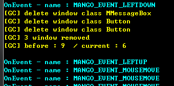
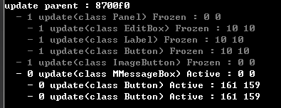

Mango
====

* __사용 언어__ : C++
* __설명__ : SDL을 위한 UI프레임워크입니다.

Example
----
* 컨트롤 생성하기
```C++
auto panel = new Panel(0,0,300,300);
auto edit = new EditBox(80,10, 180,30, "placeholder");
auto label = new Label(10,10, "입력 : ");
auto button = new Button(220, 10, 70,25, "적용");
```
* 컨트롤 계층 구조 설정하기
```C++
panel->addChild(button);
```
* 핸들러 등록하기
```C++
button->clickedHandler = 
  [](Window *window, int x,int y){
    auto btn = (Button*)window;
    char msg[128];
    
    sprintf_s(msg, "클릭됨 : %d, %d", x,y);
    
    btn->setText(msg);
  };
```

Screenshots
----
<br>
<br>
<br>
<br>
<br>
<br>
<br>

