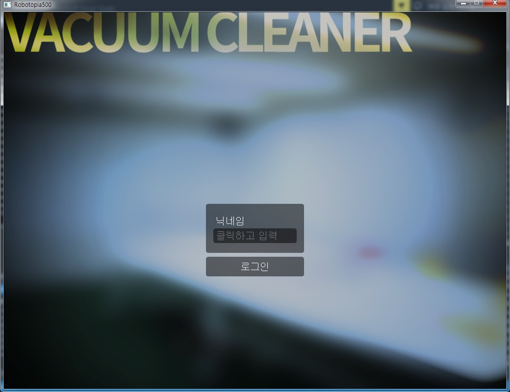
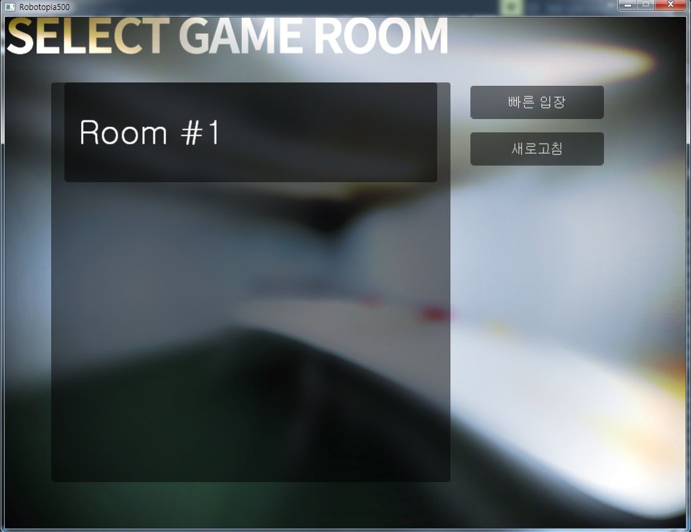
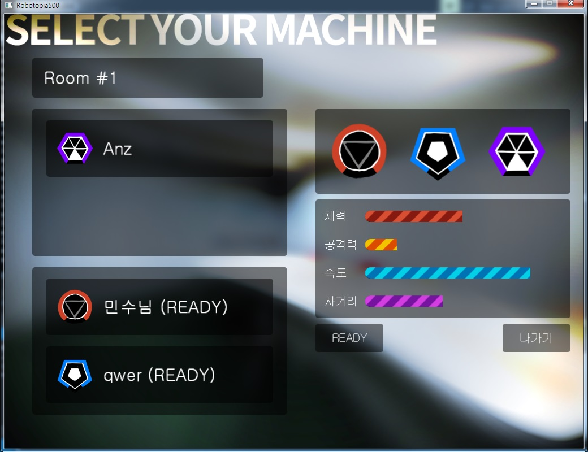
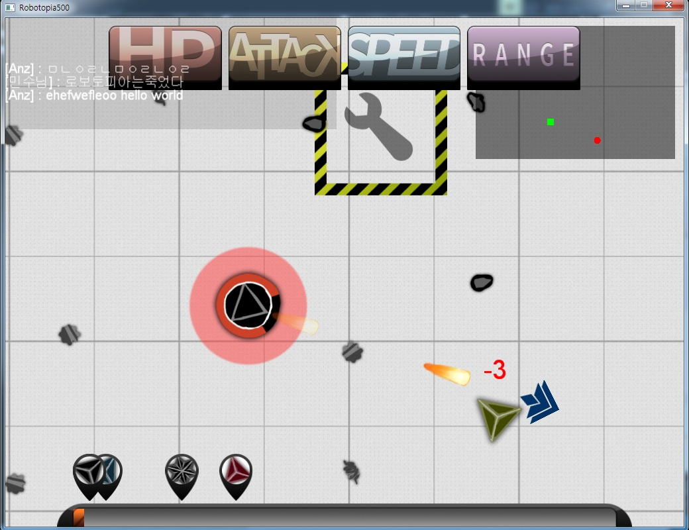
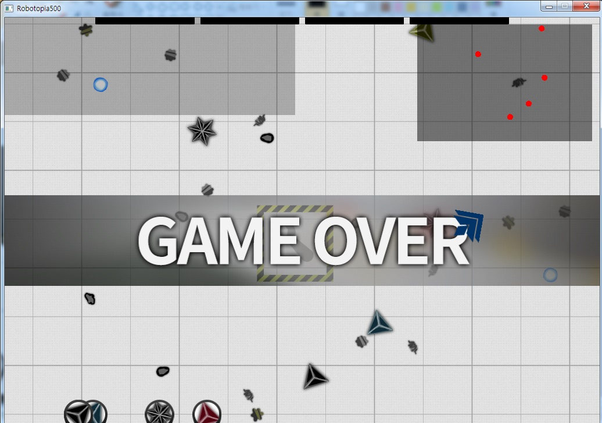
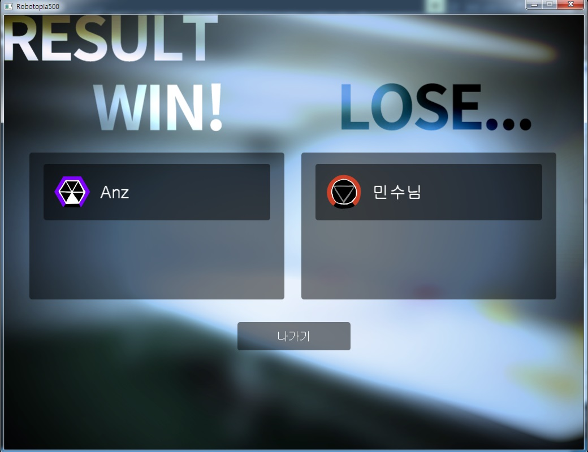

VacuumCleaner
====

* __사용 언어__ : C++
* __설명__ : NHN NEXT의 3학기 개발경험프로젝트 과목을 수강하면서 제작한 게임입니다.
  * 2인 팀으로 제작하였습니다.
  * 온라인 게임이며, 클라이언트는 cocos2d, 서버는 iocp를 이용해 바닥부터 제작하였습니다.

Links
----
* [컨셉 기획서](https://docs.google.com/document/d/16gD7MowB0o4ZP13gcutiGXxGiiw915KenK5swTuI444/edit)
* [플레이 방법](https://github.com/SubwayRocketTeam/game/blob/master/doc/HowToPlay.md)

Screenshots
----
 
 
 
 
 

